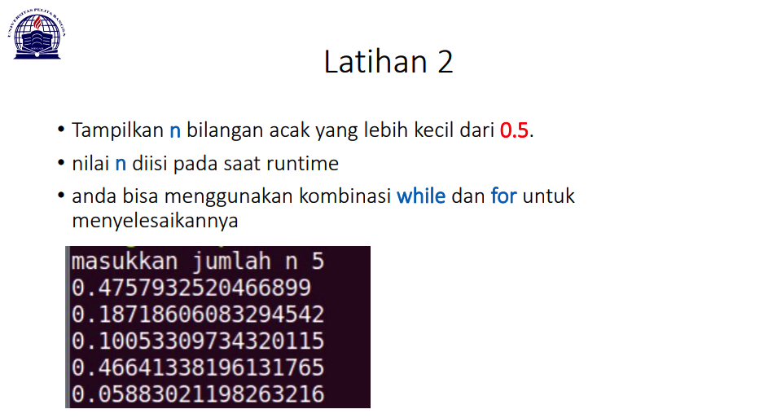

## Lab 3
## Latihan 1


```
#bilangan bertingkat(nested)
for row in range(0, 10):
    for col in range(0, 10):
        num = row + col
        if num < 10:
            empty = "  "
        else:
            if num < 100:
                empty  = " "
        print(empty, num, end = '')
    print()
```
Penjelasan:
* ``for row in range(0, 10):`` ``for col in range(0, 10):`` Variabel row / col berfungsi untuk menampung baris dan kolom, dan fungsi range() berfungsi untuk membuat list dengan area dari 0-10
* 



```
import random
nilai = int(input('Masukan nilai n : '))
a = 0
for x in range (nilai):
    i = random.uniform(.0,.5)
    a+=1
    print('data ke :',a,'==>', i)
```