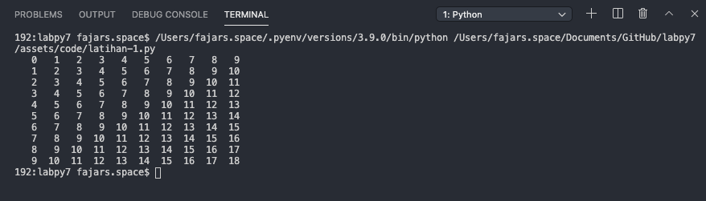
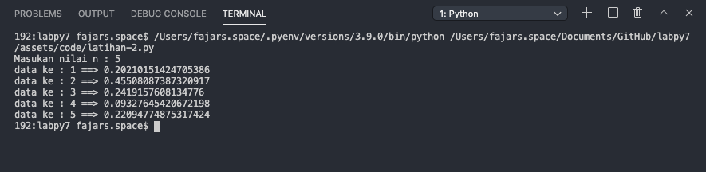
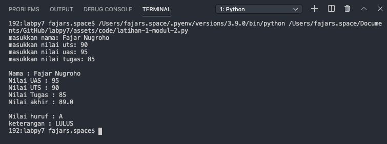
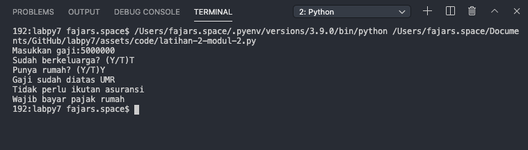
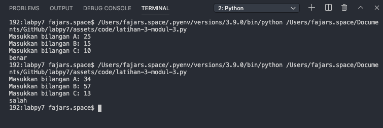

# Lab 3
## Latihan 1


```
for row in range(0, 10):
    for col in range(0, 10):
        num = row + col
        if num < 10:
            empty = "  "
        else:
            if num < 100:
                empty  = " "
        print(empty, num, end = '')
    print()
```
Penjelasan:
* ``for row in range(0, 10):`` ``for col in range(0, 10):`` Variabel row / col berfungsi untuk menampung baris dan kolom, dan fungsi range() berfungsi untuk membuat list dengan area dari 0-10
* 

Output:




```
import random
nilai = int(input('Masukan nilai n : '))
a = 0
for x in range (nilai):
    i = random.uniform(.0,.5)
    a+=1
    print('data ke :',a,'==>', i)
```
Penjelasan:
* ``import random`` berfungsi untuk memanggil library random, dimana random berfungsi untuk menentukan pilihan secara acak
* ``nilai = int(input('Masukan nilai n : '))`` untuk menginputkan nilai berupa integer
* range() berfungsi menghasilkan list

Output:



# Modul Praktikum 2
## Latihan 1: Membuat program menentukan nilai akhir
```
nama = input('masukkan nama: ')
uts = input('masukkan nilai uts: ')
uas = input('masukkan nilai uas: ')
tugas = input('masukkan nilai tugas: ')
akhir = (int(tugas) * .2) + (int(uts) * .4) + (int(uts) * .4)
keterangan = ('TIDAK LULUS', 'LULUS')[akhir > 60.0]
if akhir > 80:
    huruf = 'A'
elif akhir > 70:
    huruf = 'B'
elif akhir > 50:
    huruf = 'C'
elif akhir > 40:
    huruf = 'D'
else:
    huruf = 'E'

print("\nNama :",nama) 
print("Nilai UAS :",uas) 
print("Nilai UTS :",uts) 
print("Nilai akhir :",akhir) 
print("\nNilai huruf :",huruf) 
print("keterangan :",keterangan) 

```
Output:



## Latihan 2: Membuat program menampilkan status gaji karyawan

```
gaji = int(input("Masukkan gaji:"))
berkeluarga = (False, True)[input("Sudah berkeluarga? (Y/T)") == "Y"]
punya_rumah = (False, True)[input("Punya rumah? (Y/T)") == "Y"]
if gaji > 3000000:
 print ("Gaji sudah diatas UMR")
 if berkeluarga:
     print ("Wajib ikutan asuransi dan menabung untuk pensiun")
 else:
     print("Tidak perlu ikutan asuransi")
 if punya_rumah:
     print("Wajib bayar pajak rumah")
 else:
     print("tidak wajib bayar pajak rumah")
else:
    print("Gaji belum UMR")
```
Output:



## Latihan 3: penggunaan kondisi OR program membandingkan 3 input bilangan, apabila penjumlahan 2 bilangan hasilnya sama dengan bilangan lainnya, maka cetak pernyataan “BENAR”

```
a = int(input('Masukkan bilangan A: '))
b = int(input('Masukkan bilangan B: '))
c = int(input('Masukkan bilangan C: '))
if a+b == c or b+c == a or c+a == b:
    print('benar')
else: print('salah')
```
Output:


