# Lab 3
## Latihan 1

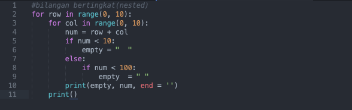

Penjelasan:

Output:

## Latihan 2

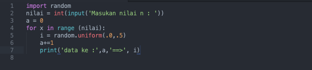

Penjelasan:
* ``import random`` berfungsi untuk memanggil library random, dimana random berfungsi untuk menentukan pilihan secara acak
* ``nilai = int(input('Masukan nilai n : '))`` untuk menginputkan nilai berupa integer
* range() berfungsi menghasilkan list
* masukkan ``i = random.uniform (.0,.5)`` di gunakan untuk menampilkan bilangan float random, lalu masukkan a+=1 untuk memberi nomer pada bilangan float.
* ``print('data ke :',a,'==>', i)`` untuk menampilkan output data

Output:

# Modul Praktikum 2
## Latihan 1: Membuat program menentukan nilai akhir

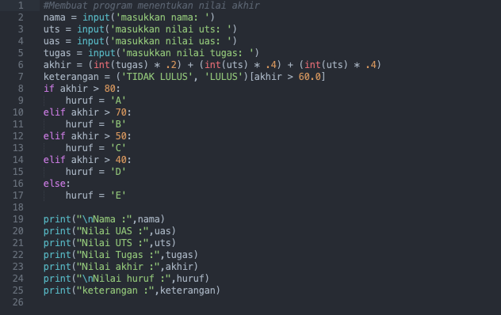

Penjelasan:
* Masukkan nilai yang sudah di tentukan oleh variabel, seperti ``nama, uts, uas,tugas``
* untuk ``akhir = (int(tugas) * .2) + (int(uts) * .4) + (int(uts) * .4)``
* 

Output:

## Latihan 2: Membuat program menampilkan status gaji karyawan

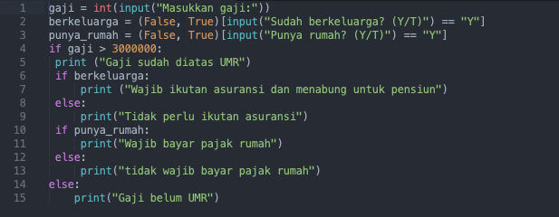

Penjelasan:

Output:

## Latihan 3: penggunaan kondisi OR program membandingkan 3 input bilangan, apabila penjumlahan 2 bilangan hasilnya sama dengan bilangan lainnya, maka cetak pernyataan “BENAR”

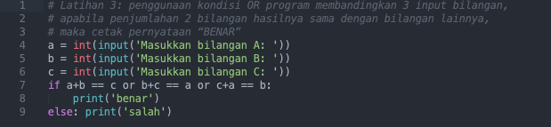

Penjelasan:

Output:

## Tugas Praktikum 2

Penjelasan:

Output:

Flowchart
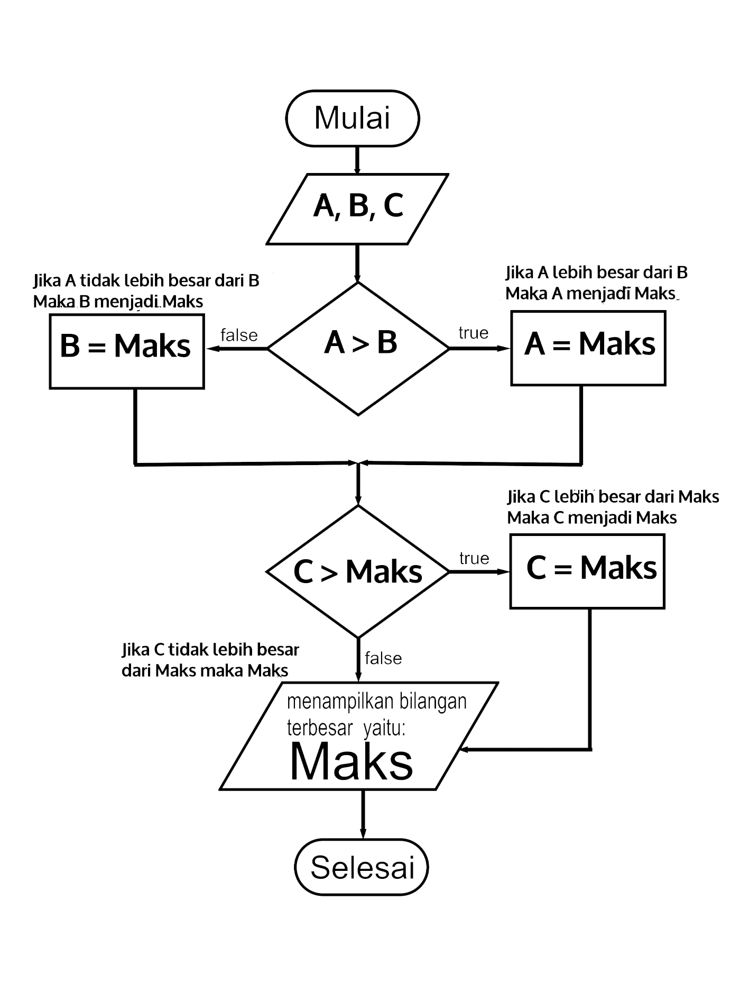

# Modul Praktikum 3
## Latihan 1
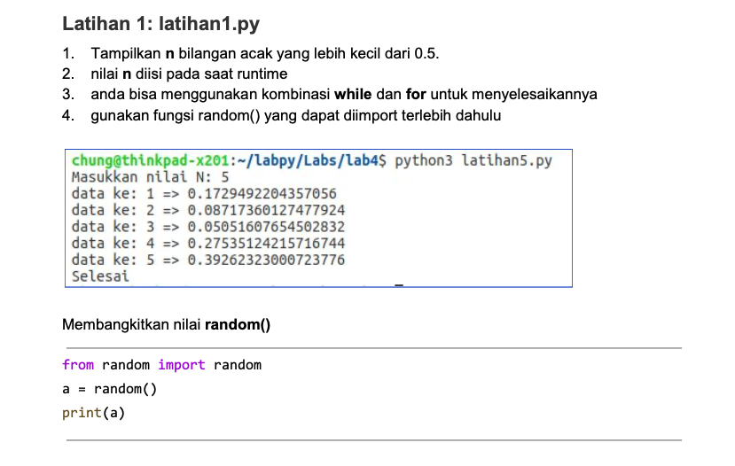

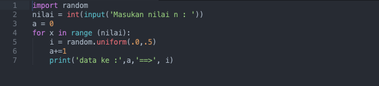

Penjelasan:
* ``import random`` berfungsi untuk memanggil library random, dimana random berfungsi untuk menentukan pilihan secara acak
* ``nilai = int(input('Masukan nilai n : '))`` untuk menginputkan nilai berupa integer
* range() berfungsi menghasilkan list
* masukkan ``i = random.uniform (.0,.5)`` di gunakan untuk menampilkan bilangan float random, lalu masukkan a+=1 untuk memberi nomer pada bilangan float.
* ``print('data ke :',a,'==>', i)`` untuk menampilkan output data

Output:

## Latihan 2

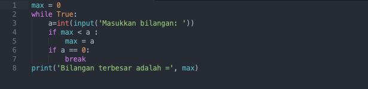

Penjelasan:
* Integer max = 0

* fungsi perulangan ``while true`` hingga menampilkan perulangan sampai batas tertentu.

* Memasukan bilangan integer pada "a"

* Menggunakan fungsi ``if`` jika max kurang dari nilai a, maka max sama dengan a

* Mengunakan fungsi ``if`` jika nilai a adalah 0 maka fungsi ``break`` artinya perulangan berhenti jika menulis nilai 0

* Mencetak nilai paling terbesar setelah ``break``, sehingga menampilkan nilai terbesar diantara bilangan tersebut dalam perulangan.

Output:

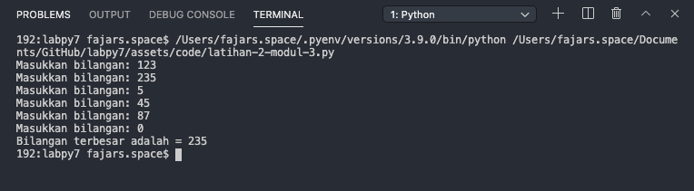

## Tugas Praktikum 3

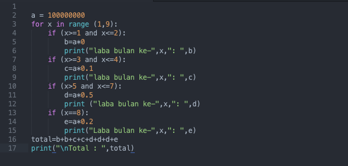

Penjelasan:
* Variabel ``a = 100.000.000`` modal awal

* Menggunakan fungsi looping for pada nilai x 1-9 untuk menampilkan bulan 1 sampai bulan 8.

* Menggunakan fungsi ``if``, untuk menghitung laba bulan 1 sampai 8

* Bulan pertama dan kedua laba adalah 0

* Bulan ke 3 dan ke 4 mendapat laba 1% sehingga modal di kali 1% = keuntungan

* Bulan ke 5 mendapatkan laba 5%, sehingga modal dikali 5% = keuntungan

* Bulan ke 8 mendapatkan laba 2% sehingga keuntungan menurun dari bulan sebelumnya, modal dikali 2% = keuntungan.

* Menghitung jumlah total laba dengan menjumlah keuntungan dari bulan ke 1 sampai bulan 8, hasilnya adalah total keuntungan yang didapat ``total=b+b+c+c+d+d+d+e``

* ``print("\Total : ",total)``, untuk menampilkan hasil keseluruhan laba dari bulan pertama sampai bulan kedelapan.

Output:

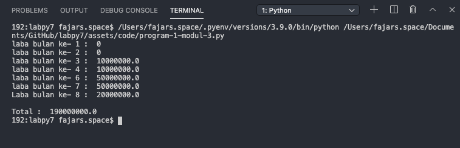
